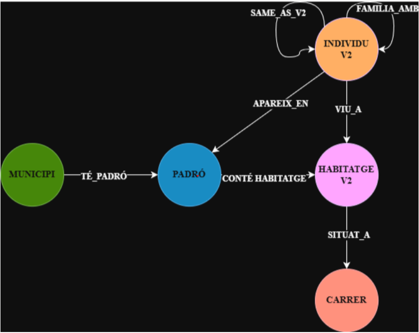

# Historical Census Graph Database

Historical census data modelling, ingestion and analysis using **Neo4j**, **Cypher** and **Neo4j Graph Data Science**.

## Overview

This project was developed as part of the **Non-Relational Databases** course in the BSc in Data Engineering at Universitat Autònoma de Barcelona (UAB).

The goal was to model and analyse historical census records as a graph database, connecting individuals, households, family relationships and census records across different years and municipalities.

The project covered the complete process from **CSV data ingestion and cleaning** to **graph modelling, analytical queries, schema redesign and graph analysis**.

It was developed as an **academic team project with four members**.

## Key Features

* CSV data ingestion using `LOAD CSV`
* Data cleaning and normalisation during ingestion
* Handling of missing, `null` and `nan` values
* Idempotent node and relationship creation using `MERGE`
* Unique constraints to maintain data integrity
* Indexes designed to support query performance
* Modelling of individuals, households and family relationships
* Historical person linkage using `SAME_AS` relationships
* Analytical queries using Cypher
* Alternative graph schema design and migration
* Comparison between two graph modelling approaches
* Connected components analysis
* Node similarity analysis using Neo4j Graph Data Science

## Technologies

* **Neo4j**
* **Cypher**
* **Neo4j Graph Data Science (GDS)**
* **CSV**
* Graph data modelling
* Data cleaning and transformation
* Indexing and constraints

## Original Graph Model

The original model represents historical census information mainly through:

* `Individu` — a person's appearance in a census record
* `Habitatge` — a household
* `VIU` — connects an individual to their household
* `FAMILIA` — represents family relationships
* `SAME_AS` — links different historical appearances of the same person

Household properties such as municipality, census year and street are stored directly on the `Habitatge` nodes.

## Alternative Graph Model

An alternative schema was designed to represent important domain concepts as independent graph entities instead of storing them only as properties.

The redesigned model introduces:

* `Municipi`
* `Padro`
* `HabitatgeV2`
* `Carrer`
* `IndividuV2`

and relationships such as:

* `TE_PADRO`
* `CONTE_HABITATGE`
* `SITUAT_A`
* `VIU_A`
* `APAREIX_EN`
* `FAMILIA_AMB`
* `SAME_AS_V2`

This makes concepts such as municipalities, census years and streets explicit parts of the graph and allows them to be traversed directly.

### Alternative schema



The original schema is more compact, while the alternative schema is more expressive and easier to extend for territorial and temporal analysis.

## Data Ingestion

The ingestion scripts create the graph from several CSV sources representing individuals, households and relationships.

The process includes:

* validating identifiers before creating nodes
* normalising text values
* converting numeric properties to appropriate types
* filtering invalid values
* creating artificial composite identifiers when necessary
* creating nodes and relationships with `MERGE`
* defining constraints before ingestion
* defining indexes for frequently queried properties

For example, households are uniquely identified using a key based on:

```text
municipality + census year + household ID
```

This avoids collisions when the same household identifier appears in different municipalities or census years.

See:

```text
data-ingestion/original-schema-ingestion.cypher
schema-redesign/alternative-schema-ingestion.cypher
```

## Example Queries

The project includes several Cypher queries for analysing the historical census graph.

### Census surnames by year

Returns, for each census year in a municipality:

* census year
* number of inhabitants
* distinct surnames

Invalid or missing surname values are filtered during the query.

```text
queries/census-surnames-by-year.cypher
```

### Household members

Finds a specific historical individual and retrieves the other people living in the same household.

```text
queries/household-members-graph.cypher
```

### Historical person linkage

Uses variable-length `SAME_AS` relationships to retrieve different historical appearances of the same person, even when spelling variations exist between census records.

```text
queries/historical-person-linkage.cypher
```

### Average children per household

Calculates the total number of children, number of households and average number of children per household for a municipality and census year.

```text
queries/average-children-per-household.cypher
```

### Large families

Finds families with more than three children and ranks them by family size.

```text
queries/large-families.cypher
```

### Least populated streets

Calculates the street with the fewest inhabitants for each census year using aggregation and a Cypher subquery.

```text
queries/least-populated-streets.cypher
```

## Schema Comparison

Two analytical tasks were implemented using both the original and redesigned schemas to compare how the modelling approach affects the queries.

### Population and households

Calculates, for each municipality and census year:

* number of inhabitants
* number of households

```text
schema-redesign/population-housing-original-schema.cypher
schema-redesign/population-housing-alternative-schema.cypher
```

### Most populated streets

Returns the streets with the highest number of inhabitants for a specific municipality and census year.

```text
schema-redesign/top-streets-original-schema.cypher
schema-redesign/top-streets-alternative-schema.cypher
```

The comparison showed the trade-off between a **simpler and more compact original model** and a **more expressive alternative model** where municipalities, census records and streets are first-class graph entities.

## Graph Analytics

Neo4j Graph Data Science was used to explore structural properties of the graph.

### Connected Components

A graph projection containing individuals, households and residence relationships was analysed using **Weakly Connected Components (WCC)**.

The analysis was used to:

* identify the largest connected components
* study the fragmentation of the graph
* detect components containing individuals without an associated household

```text
graph-analytics/connected-components.cypher
```

### Node Similarity

A second graph projection was created to analyse structural similarity between nodes.

The workflow included:

* connecting households that represent the same physical address across different census years
* projecting residence, family and household relationships
* running Neo4j GDS `nodeSimilarity`
* writing similarity relationships back to the graph
* querying the most similar pairs

```text
graph-analytics/node-similarity.cypher
```

## Repository Structure

```text
historical-census-graph-database/
│
├── data-ingestion/
│   └── original-schema-ingestion.cypher
│
├── queries/
│   ├── census-surnames-by-year.cypher
│   ├── household-members-graph.cypher
│   ├── historical-person-linkage.cypher
│   ├── average-children-per-household.cypher
│   ├── large-families.cypher
│   └── least-populated-streets.cypher
│
├── schema-redesign/
│   ├── alternative-schema-ingestion.cypher
│   ├── population-housing-original-schema.cypher
│   ├── population-housing-alternative-schema.cypher
│   ├── top-streets-original-schema.cypher
│   └── top-streets-alternative-schema.cypher
│
├── graph-analytics/
│   ├── connected-components.cypher
│   └── node-similarity.cypher
│
├── assets/
│   └── alternative-schema.png
│
└── README.md
```

## My Contributions

This was a four-person academic team project.

My main contributions were:

* Designing and implementing **Neo4j constraints and indexes** for data integrity and query support
* Developing several **Cypher analytical queries**
* Contributing to the **data ingestion process for the redesigned graph schema**
* Contributing to the **technical documentation and structural organisation** of the final project report

All members collaborated across different parts of the project and supported each other during development.

## Academic Context

**Course:** Non-Relational Databases
**Degree:** BSc in Data Engineering
**University:** Universitat Autònoma de Barcelona (UAB)
**Project period:** April–May 2026

## Data Availability

The original CSV datasets used in the academic project are not included in this public portfolio repository.

This repository focuses on the **Cypher code, graph modelling decisions, analytical queries and graph analysis** developed during the project.
